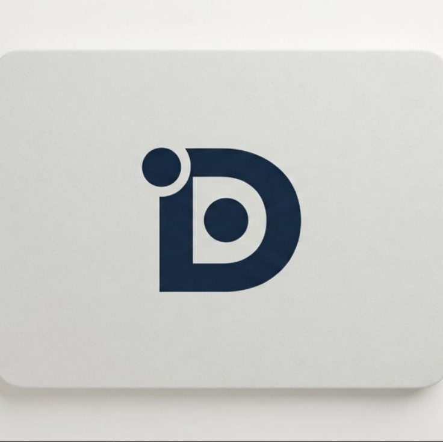
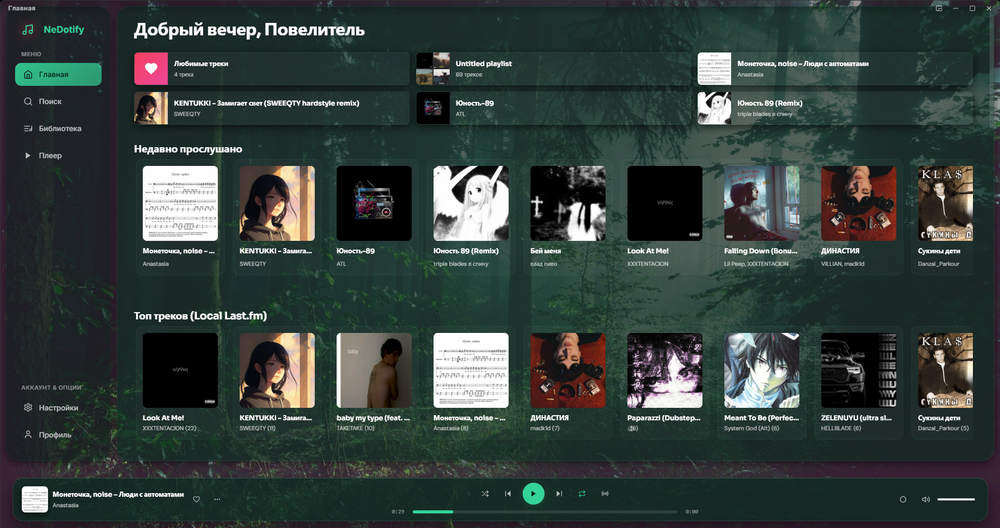
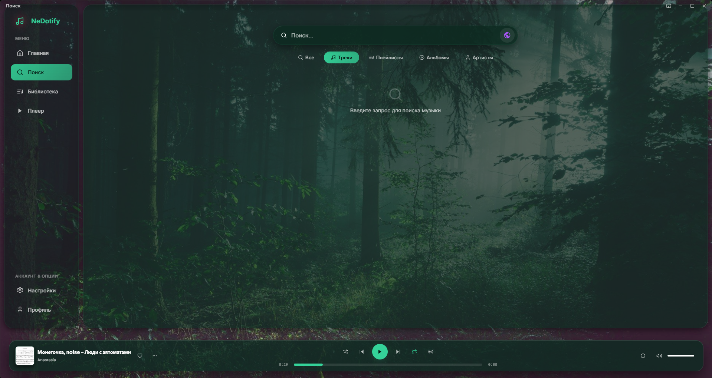
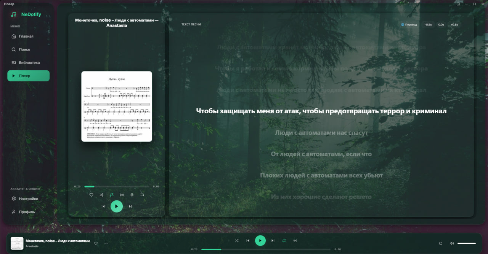
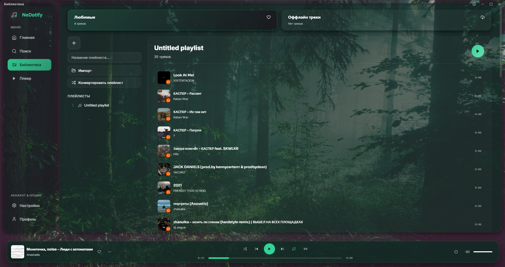
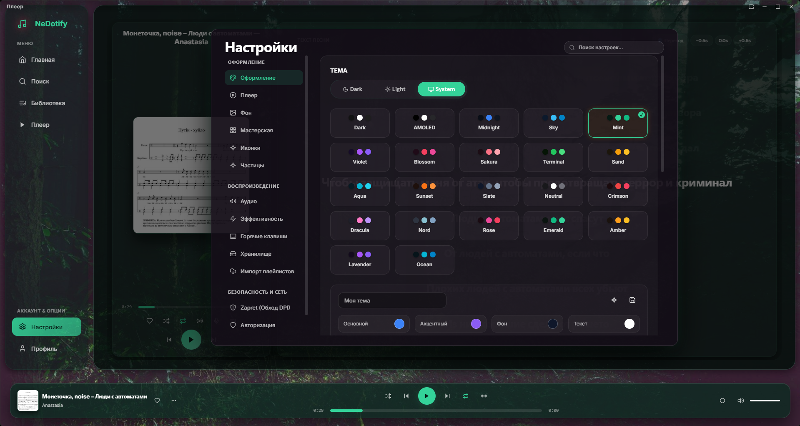
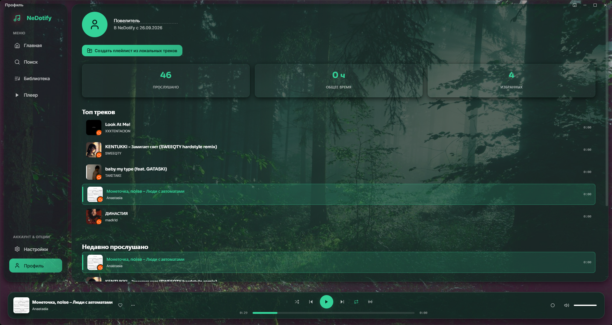

<p align="center">
  
</p>

<h1 align="center">NeDotify</h1>

<p align="center">
  Плеер для Windows. Свои файлы или стриминг с&nbsp;YouTube&nbsp;Music, Spotify,<br>SoundCloud и&nbsp;Яндекс.Музыки.
</p>

<p align="center">
  <a href="https://github.com/PoviceProgrammer/NeDotify/releases">
    
  </a>
</p>

<p align="center">
  
  
  
  
</p>

---

## 📸 Скриншоты

<table>
  <tr>
    <td width="50%" align="center"><br><sub><b>Главная</b> — недавние треки и локальный топ</sub></td>
    <td width="50%" align="center"><br><sub><b>Поиск</b> — треки, плейлисты, альбомы, артисты</sub></td>
  </tr>
  <tr>
    <td align="center"><br><sub><b>Плеер</b> — обложка, управление, текст песни со сдвигом ±0.5&nbsp;с</sub></td>
    <td align="center"><br><sub><b>Библиотека</b> — плейлисты, импорт, офлайн-треки</sub></td>
  </tr>
  <tr>
    <td align="center"><br><sub><b>Темы</b> — готовые пресеты и свои цвета</sub></td>
    <td align="center"><br><sub><b>Профиль</b> — сколько послушал, топ треков, история</sub></td>
  </tr>
</table>

---

## ✨ Возможности

**Источники**

- 🎧 Стриминг с YouTube Music, Spotify, SoundCloud и Яндекс.Музыки
- 📥 Офлайн-треки: плейлисты импортируются и качаются на диск
- 🎼 Чтение тегов из локальных файлов, эквалайзер на 10 полос

**Воспроизведение**

- 🎤 Тексты песни по строкам, сдвиг синхронизации ±0.5&nbsp;с, перевод
- 📊 Визуализатор
- 🔁 Повтор, перемешивание, перетаскивание треков в очереди
- 🪟 Мини-плеер поверх других окон
- ⌨️ Горячие клавиши — любую можно переназначить

**Интерфейс**

- 🎨 Темы оформления, можно собрать свою
- 📀 Плейлисты: создать, импортировать, скачать офлайн
- 🕹️ Discord Rich Presence — статус об играющем треке

---

## 📦 Установка

Установщик `.exe` ставит ярлыки на рабочий стол и в меню «Пуск».
Актуальная сборка — **5.0 Beta**, файл `Beta5_Setup.exe` на странице релизов:

**[Скачать на GitHub Releases](https://github.com/PoviceProgrammer/NeDotify/releases)**

Собрать самому (имя выходного файла задаёт `OutputBaseFilename` в `installer.iss`):

```bash
.venv_win\Scripts\python.exe -m pip install -r requirements.txt
.venv_win\Scripts\python.exe -m PyInstaller setup_pyinstaller.spec
iscc installer.iss
```

На выходе — `dist\Beta5_Setup.exe`.

---

## 🧑‍💻 Запуск из исходников

```bash
git clone https://github.com/PoviceProgrammer/NeDotify.git
cd NeDotify

python -m venv .venv_win
.venv_win\Scripts\python.exe -m pip install -r requirements.txt
.venv_win\Scripts\python.exe main.py
```

> Системный `python` не подойдёт — в нём нет `pywebview` и `yt-dlp`.
> Нужен именно интерпретатор из `.venv_win`.

---

## 🧪 Тесты

```bash
.venv_win\Scripts\python.exe -m pytest -m "not network"
```

Флаг `not network` пропускает тесты, которым нужен реальный доступ к площадкам —
так же, как в CI.

---

## 🌐 Если площадки не открываются

YouTube, Spotify и SoundCloud иногда недоступны без VPN. Своё прокси можно
указать в **Настройки → Хранилище**, поле `proxy_url`.

Если нужен готовый вариант: [TequilaVPN](https://t.me/TequilaVPNbot?start=refugkQUieF).

---

## 🛠 Стек

Python 3.14 · pywebview + WebView2 · SQLite (WAL) · yt-dlp · Vanilla JS

Фронтенд без сборщика и бандлера: правьте `ui/web_new_v2/` и перезапускайте.
Ветка `ui/web_new/` — устаревшая версия интерфейса, её изменения никуда не попадают.

---

## 📄 Лицензия

Учебный проект, для ознакомления.
